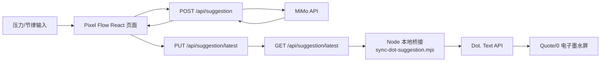

# 像素心流与 Dot（墨水屏）AI 建议推送技术文档

## 1. 目标

本方案将 Pixel Flow 网页中的 MiMo AI 建议同步到 MindReset Dot. Quote/0 电子墨水屏。网页负责产生建议，本地桥接进程负责读取最新建议、判断内容是否变化，并通过 Dot. OpenAPI 更新设备。

当前显示内容由以下部分组成：

- 标题：AI 建议的短标题
- 正文：AI 建议内容
- 小字签名：`像素心流推送 HH:mm`，使用中国时区

## 2. 技术组成

| 层级      | 技术                                               | 用途                                               |
| --------- | -------------------------------------------------- | -------------------------------------------------- |
| AI 协作   | OpenAI Codex Desktop、Codex plugins/skills         | 安装 Dot. 插件、调用设备能力、协助开发和验证       |
| Dot. 集成 | `dot-skill`、Dot. OpenAPI                          | 获取设备/任务信息，发送 Text API 与 Image API 内容 |
| 前端      | React 19、TypeScript、Next App Router、Vinext/Vite | Pixel Flow 网页、实时压力展示和建议界面            |
| AI 建议   | MiMo Chat Completions API                          | 根据压力、节律与输入状态生成非诊断式日常建议       |
| 本地接口  | Next Route Handlers                                | 提供建议生成接口和最新建议 JSON 接口               |
| 本地桥接  | Node.js 原生 `fetch`、定时轮询                     | 每分钟读取建议并发送到 Dot.                        |
| 设备显示  | Quote/0 Text API                                   | 将标题、正文和签名渲染到 296 x 152 电子墨水屏      |
| 图片处理  | Image Generation、PNG 缩放                         | 将图片调整为 Quote/0 的横向 `296 x 152` 比例后发送 |
| 后台启动  | Windows PowerShell `Start-Process`                 | 在本机以隐藏 Node 进程启动同步桥接                 |

## 3. 总体架构



这是一种“网页主动发布数据、桥接程序订阅式读取”的设计，而不是由 Codex 反复读取浏览器 DOM。这样可避免浏览器会话、页面刷新和 UI 结构变化影响同步稳定性。

## 4. Codex 与插件

### 4.1 插件安装

已安装的第三方市场和插件为：

```text
mindreset-dot-skill
dot-skill@mindreset-dot-skill
```

插件提供三个主要 skills：

- `dot-device-openapi`：列出设备、查询状态、发送文字/图片/Canvas 内容
- `dot-canvas-designer`：设计 Canvas API 的 `windowData`
- `dot-openapi`：兼容路由，按需求转向以上两个技能

Codex 只在开发、手动操作或启动本地服务时参与。已启动的桥接程序本身是本机 Node.js 进程，并不需要 Codex 持续在线。

### 4.2 Dot. 认证与设备标识

桥接程序从当前用户环境变量读取配置：

```text
DOT_API_KEY
DOT_DEVICE_ID
DOT_TASK_KEY
DOT_SYNC_TIME_ZONE=Asia/Shanghai
```

其中：

- `DOT_API_KEY`：Dot. App 的开放平台 API Key，以 `dot_app_` 开头
- `DOT_DEVICE_ID`：Quote/0 设备序列号
- `DOT_TASK_KEY`：Dot. App Content Studio 中已有 Text API 内容项的键
- `DOT_SYNC_TIME_ZONE`：签名显示时间所用时区

API Key 不应写进源代码、`.env` 以外的配置文件、日志或聊天记录。若 API Key 曾被直接暴露，应在 Dot. App 中重新生成并替换。

## 5. Pixel Flow 网页接口

项目目录：

```text
C:\Users\Xu Zhongmao\Documents\Codex\2026-07-25\adhd
```

### 5.1 MiMo 建议生成

文件：`app/api/suggestion/route.ts`

网页前端每 30 秒向以下端点提交汇总后的信号数据：

```text
POST /api/suggestion
```

输入包括压力数值、趋势、波动次数、高压阈值、输入来源，以及用户授权的抽象节律数值。该端点调用 MiMo API，并返回：

```json
{
  "eyebrow": "MiMo 建议",
  "title": "简短标题",
  "body": "建议正文",
  "action": "下一小步",
  "meta": {
    "provider": "MiMo",
    "model": "mimo-v2.5-pro",
    "generatedAt": "2026-07-25T00:00:00.000Z"
  }
}
```

### 5.2 最新建议接口

文件：`app/api/suggestion/latest/route.ts`

新增了稳定的本地 JSON 接口：

```text
GET /api/suggestion/latest
PUT /api/suggestion/latest
```

前端文件 `app/page.tsx` 会在每次成功得到 MiMo 建议后，自动以 `PUT` 写入标题、正文、动作和标签。桥接程序只需调用 `GET`，无需解析网页 DOM。

示例响应：

```json
{
  "eyebrow": "MiMo 建议",
  "title": "给手指一个小出口",
  "body": "现在的起伏很有节奏，可以用捏捏球或轻敲桌面替代无意识用力。",
  "action": "记下这个节奏",
  "updatedAt": "2026-07-25T10:42:57.940Z"
}
```

端点在本地开发服务器内存中保存最新建议。服务器重启后会暂时返回 `404`，直到网页下一次 MiMo 分析完成并重新发布建议；网页默认会在下一个分析周期恢复该数据。

## 6. 本地桥接程序

文件：`scripts/sync-dot-suggestion.mjs`

包脚本：

```text
npm run dot:sync
npm run dot:sync:once
```

桥接逻辑如下：

1. 请求 `http://127.0.0.1:8569/api/suggestion/latest`。
2. 若尚无建议，等待下一轮。
3. 以 `title + body` 生成内容指纹。
4. 与 `.dot-sync-state.json` 中的上一次成功同步指纹比较。
5. 内容相同则跳过，避免电子墨水屏重复刷新。
6. 内容变化时，使用 UTF-8 JSON 调用 Dot. Text API。
7. 发送成功后写入新的本地指纹状态。

默认轮询间隔是 60 秒，可通过 `DOT_SYNC_INTERVAL_SECONDS` 调整；最小值为 10 秒。

发送给 Dot. 的请求主体结构如下：

```json
{
  "refreshNow": true,
  "taskKey": "<DOT_TASK_KEY>",
  "title": "AI 建议标题",
  "message": "AI 建议正文",
  "signature": "像素心流推送 20:40"
}
```

请求使用：

```text
Content-Type: application/json; charset=utf-8
Authorization: Bearer <DOT_API_KEY>
```

## 7. 中文编码处理

首次通过 PowerShell 直接组装请求体时，中文字符曾被替换为 `?`。原因是 PowerShell 的请求正文编码链路没有显式保证 UTF-8。

当前桥接使用 Node.js 的 `fetch` 和 `JSON.stringify`，并声明：

```text
Content-Type: application/json; charset=utf-8
```

服务端回读已验证中文标题、正文和签名能正常保存和显示。不要再用未明确编码的 PowerShell 字符串直接发送中文建议。

## 8. 运行方式与边界

### 8.1 当前运行方式

同步脚本由隐藏的本地 Node.js 进程运行。Codex 退出后，该进程通常仍可继续；但它不是 Windows 服务，因此以下情况会停止同步：

- Windows 重启或用户注销
- 进程被手动结束
- Pixel Flow 开发服务器停止
- 本机无法访问 Dot. 服务

### 8.2 不依赖 Codex 的启动

在普通终端中启动：

```powershell
cd C:\Users\Xu Zhongmao\Documents\Codex\2026-07-25\adhd
npm run dot:sync
```

建议后续创建 Windows 任务计划程序，在用户登录后启动此命令。这样 Codex 只负责开发与维护，日常同步由本机软件独立完成。

### 8.3 电子墨水屏刷新策略

电子墨水屏不适合高频刷新。当前方案虽然每分钟检查一次，但仅在建议标题或正文发生变化时才推送。时间签名随着实际推送更新，不会单独触发刷新。

## 9. 图片显示流程

Quote/0 的图像显示尺寸为 `296 x 152`。已使用图像生成与缩放流程，将提供的竖幅图片改为横向构图并导出 PNG，再通过 Dot. Image API 发送。图像 API 支持扩散抖动，适合电子墨水屏的黑白显示效果。

## 10. 已验证项目

- Dot. `Text API` 已成功发送中文标题、正文与签名。
- Dot. `Image API` 已成功发送 `296 x 152` 横向 PNG。
- `GET /api/suggestion/latest` 可返回网页最近的 MiMo 建议。
- 本地桥接可检测建议变化并成功推送。
- UTF-8 请求体可避免中文乱码。
- 中国时区签名已显示为 `像素心流推送 HH:mm`。